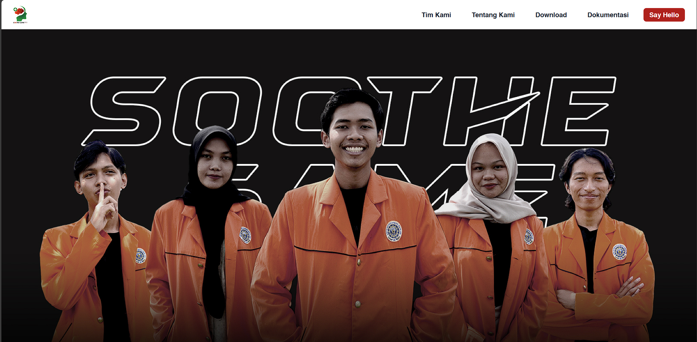
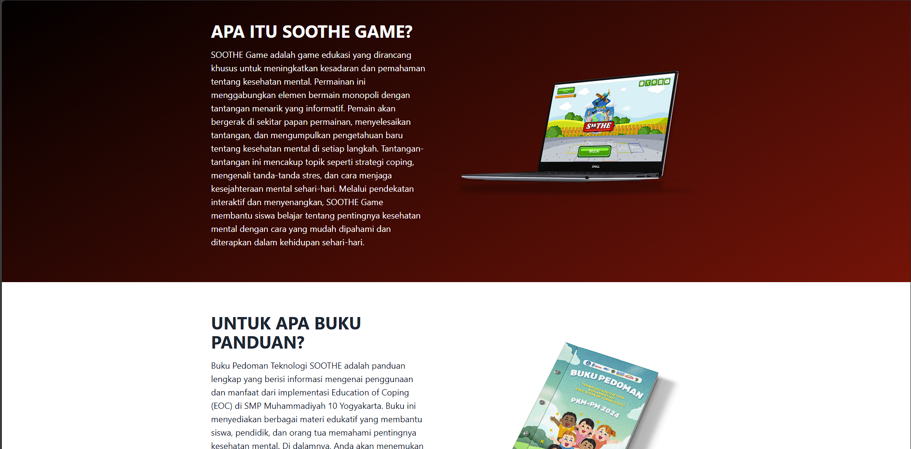
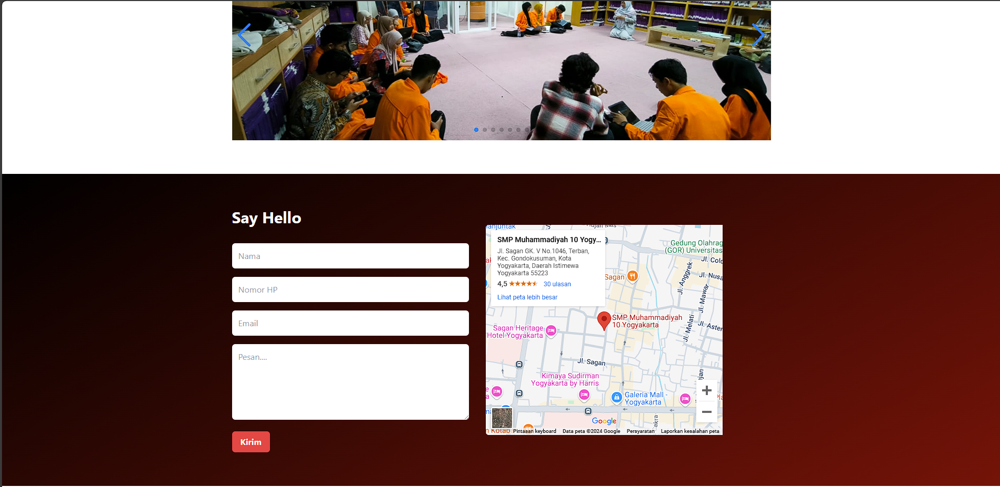

# **Website PKM-PM 2024**  
🚀 *Program Kreativitas Mahasiswa - Pengabdian Masyarakat*  

Selamat datang di proyek **Website PKM-PM**!  
Proyek ini bertujuan untuk mendukung program **Pengabdian Masyarakat** dengan judul penelitian **Teknologi Soothe: Implementasi Education of Coping (EOC) Untuk Meningkatkan Kesadaran Kesehatan Mental Generasi Z Di SMP Muhammadiyah 10 Yogyakarta**


---

## **Fitur Utama**
✨ Website ini dilengkapi dengan fitur-fitur berikut:  
- 📰 **Informasi Program:** Menyediakan informasi lengkap tentang kegiatan PKM-PM.  
- 👥 **Profil Tim:** Menampilkan profil tim mahasiswa yang terlibat dalam program.  
- 🖼️ **Galeri:** Dokumentasi foto dan video selama pelaksanaan program.
- 🔧 **Tools:** Link donwload buku panduan serta game soothe 
- 💬 **Forum & Feedback:** Sarana diskusi dan saran dari masyarakat terkait kegiatan.  

---

## **Cuplikan Layar**  
Berikut adalah beberapa cuplikan layar dari website **PKM-PM** ini:  

### Halaman Utama  


### Halaman Profil Tim  


### Penjelasan mengenai Soothe game dan buku panduan


### Halaman Galeri  


---

## **Teknologi yang Digunakan**
Proyek ini dibangun dengan teknologi berikut:  
- 🌐 **Frontend:** HTML, CSS, JavaScript  
---

## **Cara Instalasi**
Ikuti langkah-langkah di bawah ini untuk menjalankan proyek ini secara lokal:

```bash
# Clone repository ini
git clone https://github.com/username/website-pkm-pm.git

# Masuk ke folder proyek
cd website-pkm-pm

# Jika menggunakan dependensi, instal dengan:
npm install

# Jalankan server
npm start
